## K230 虚拟数字人POC

<div align=left></div>

Document version: V1.4 Release date: 2024-1-31

## 介绍

该项目为K230虚拟数字人（MetaHuman）POC开源工程，本工程基于K230融合了**人体动作捕捉**（motion capture，简称mocap）、**人体3D mesh模型**（SMPL模型）等技术。本应用可以实现人像联动，即K230摄取真人动作，通过模型inference（在K230）和post-process，再将结果传输给blender，驱动动漫character与真人联动。

## 主要特点

* 实时、无延迟

  ​    支持在k230小核端实时与blender通讯

​		   支持在k230大核端快速运行模型

* 动作精准捕捉

  ​    支持在k230大核端模型正确推理，传输至blender，并精准驱动character


## prerequisites

1、[Blender](https://www.blender.org/download/ "Blender")  (version 3.4)

2、k230


【Attention】Define the demo directory as $Meta_Human.

【First of All】

```
################  download.sh ##############

#!/bin/bash 

for file in blender_tools_v1.0.zip central_control_v1.0.zip k230_board run_sh.zip Tftpd64.zip ;  
do  
wget https://ai.b-bug.org/k230/downloads/fancy_poc/meta_human/$file || wget https://kendryte-download.canaan-creative.com/k230/downloads/fancy_poc/meta_human/$file;  
done  

for file in onboard_v2.8.zip
do
wget https://ai.b-bug.org/k230/downloads/fancy_poc/meta_human/k230_board/$file || wget https://kendryte-download.canaan-creative.com/k230/downloads/fancy_poc/meta_human/k230_board/$file;  
done

### 下载之后，请自行解压 ###
```


## Step 1   Load the addon and Enabled in Blender

```
1) Enter blender_tools and double click "canaan_k230.blend"
```

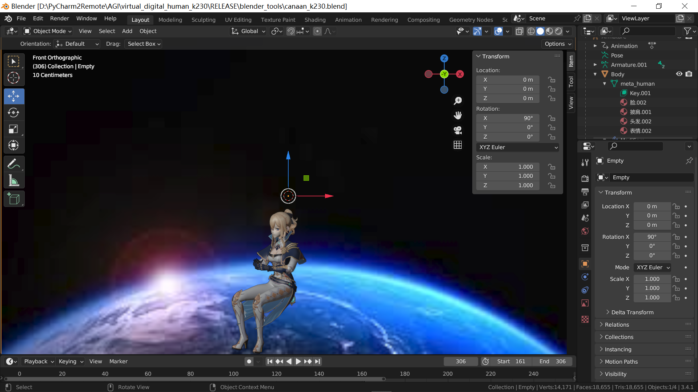

If get the "red background", please refer to 【Error Lists】-1 to solve it.

```
2) Do these operations as follow:
	Edit > Preferences > Install
   "addon_CK230.zip" in blender_tools/addons .
   
Enable "3D View:CharacterDriven-Canaan-K230".

Close the "Blender Preferences".
```

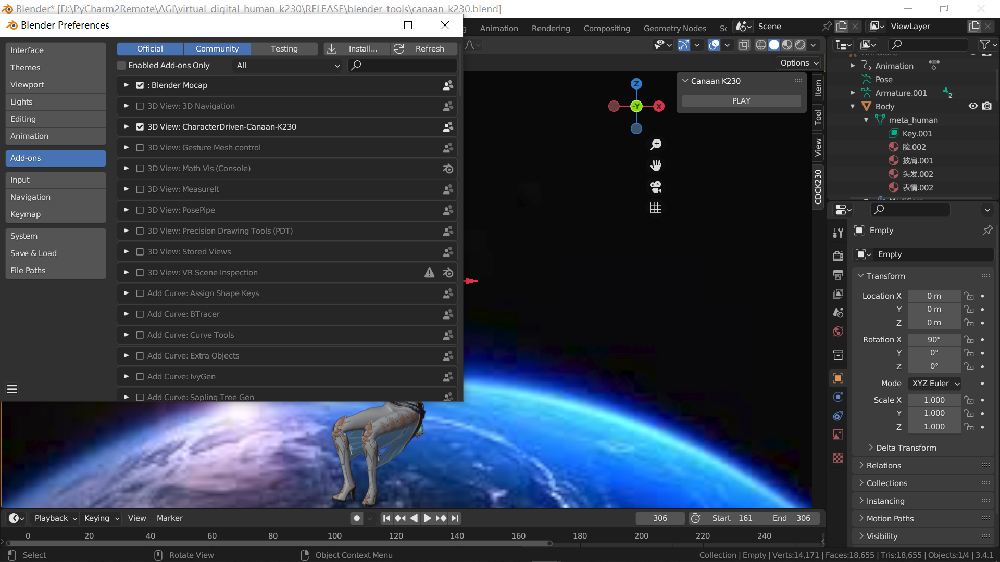

If get an error that "No module named cv2", please refer to 【Error Lists】-2 to solve it.


## Step 2   Upload "onborad" onto K230

### 串口连接线、网线、短接帽

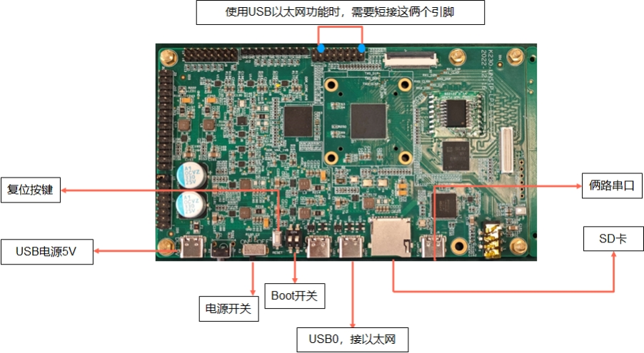


### Change adapter configuration

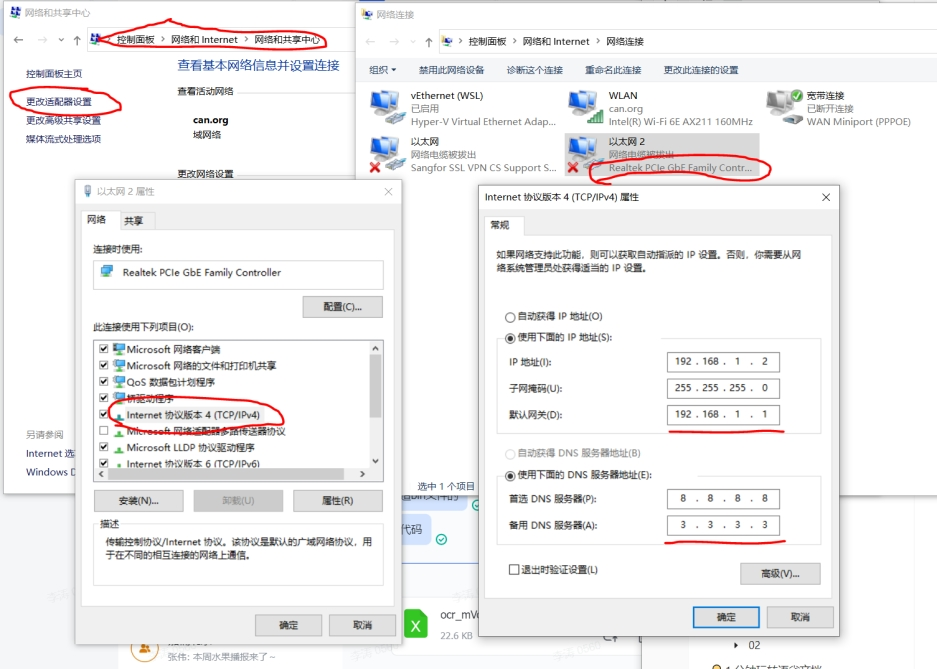

### Tftp Connect

```
Double click tftpd64.exe in Tftpd64.
"Current Directory" can be the parant directory of "onboard".
```

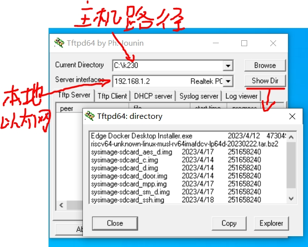

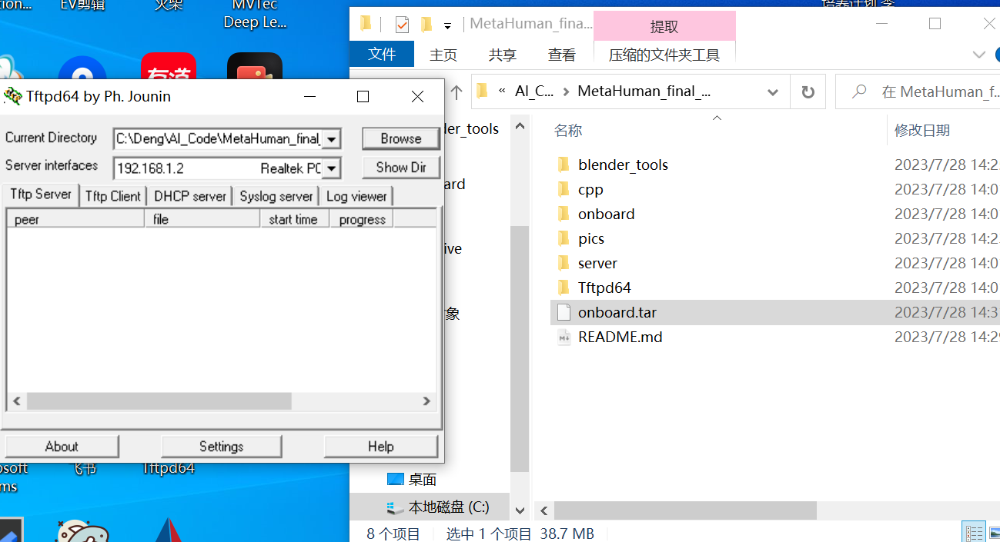


```
在小核上，
cd ~
vi run1.sh

### run1.sh ###

    ifconfig eth0 192.168.1.22
    telnet 192.168.1.22

### run1.sh ###

sh run1.sh
```


### Upload "onborad" onto K230

```
1) Compress the folder of "onboard"  and upload onto K230

2) Decompress in K230
```

需要注意的是，onboard包括上板所需的文件，其目录结构如下：

```
|--onboard
|  |--http.sh 
|  |--meta_human_256.kmodel
|  |--meta_human_isp.sh  

## meta_human_isp.sh ##

./meta_human.elf meta_human_256.kmodel None 0 6

## http.sh ##
./http 6 256

## 在k230 docker环境中在src/reference/ai_poc目录下执行./build_app.sh，即可在 k230_bin得到编译后的 meta_human.elf以及http,将其拷贝到k230上onboard文件夹下。

```


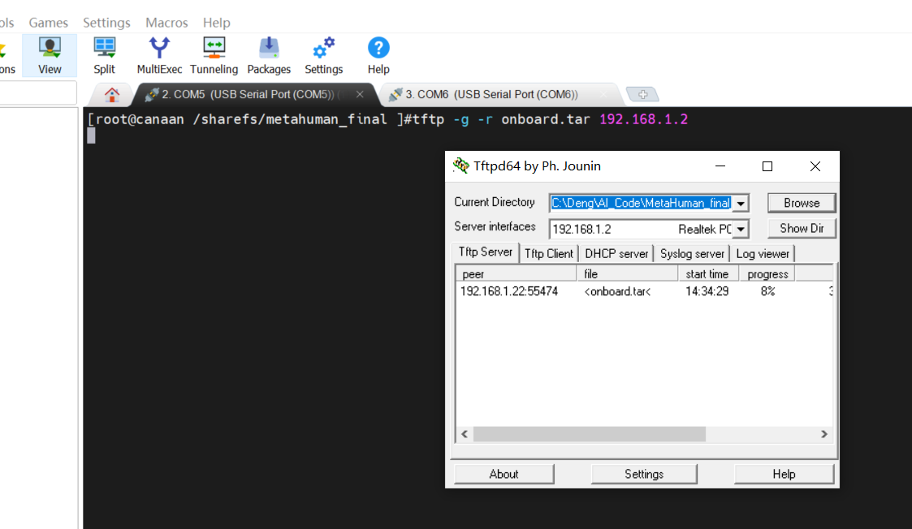


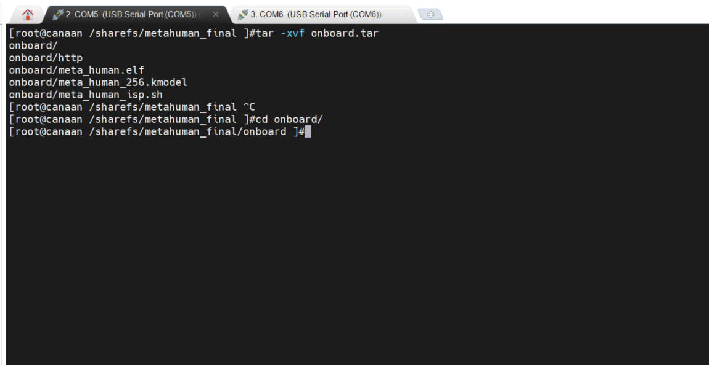


## Step 3 Run

```
1) Enter central_control  >>  input "cmd" as follow >> click "Enter" on keyboard >> input the run script "central_control.exe --input_size 256"

## central_control.exe --input_size 256 
```

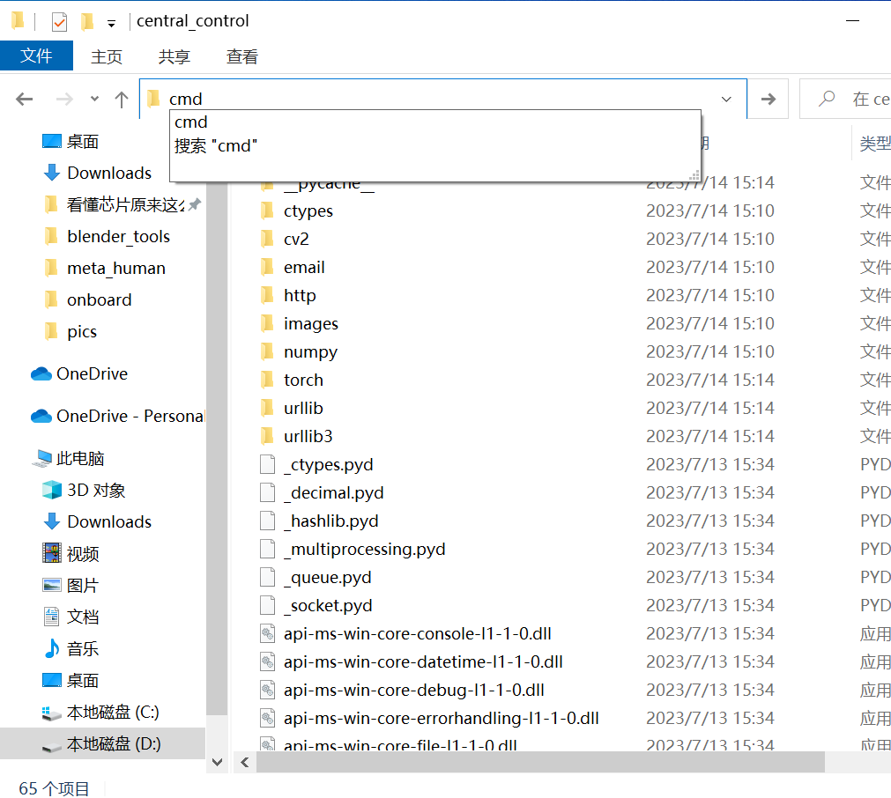

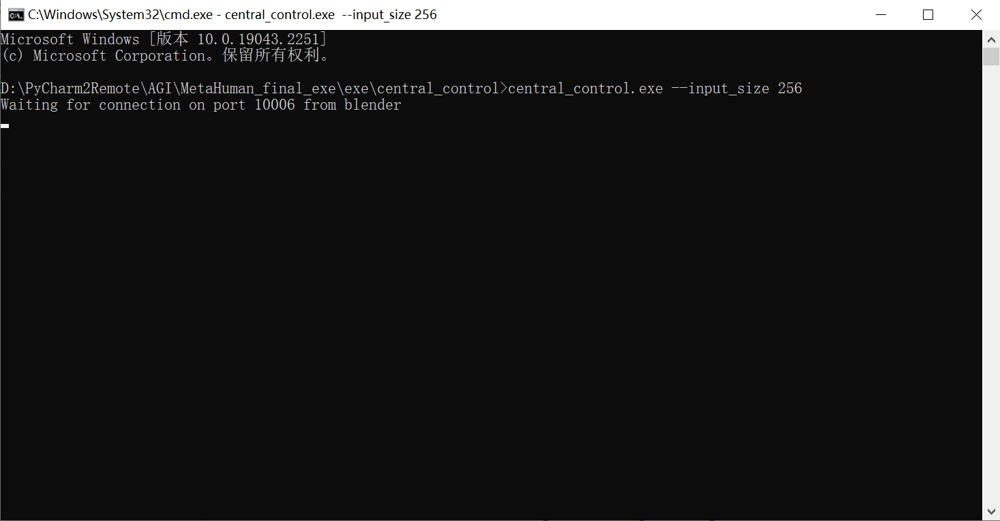


```
2) Click on  the button "PLAY" in Blender.
```

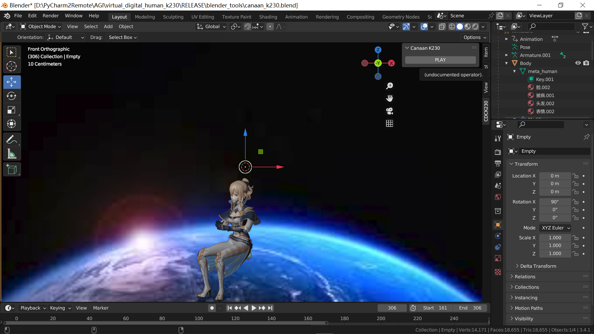


```
3) run the scripts on k230

[k230-small-core] ./http.sh 

[k230-big-core]   ./meta_human_isp.sh
```


```
####### vi http.sh #######

./http 30 256 

### the parameter '30' is the number of storage.
### the parameter '256' is the shape of kmodel.6
```


```
####### vi meta_human_isp.sh #######

./meta_human.elf meta_human_256.kmodel None 0 30

  ### the parameter '30' is the number of storage in every dir.
```


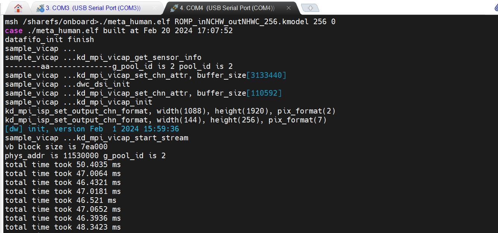


【Error Lists】

1、Blender 背景图“红屏”

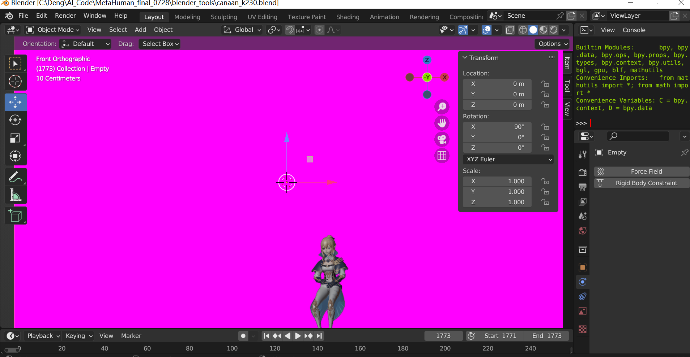

[Solution]

```
Right click on "red background" and "Delete".
```

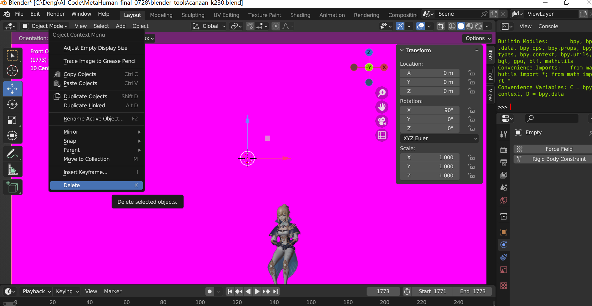

```
Do as follow
	"Add >> Image >> Background"
to select an image as background.
Then scale up the background to get the proper location.
```


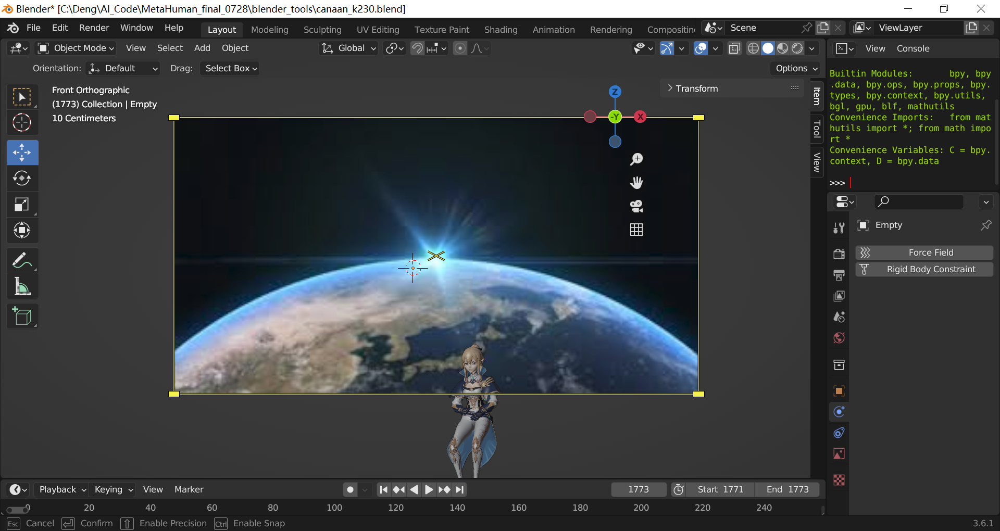

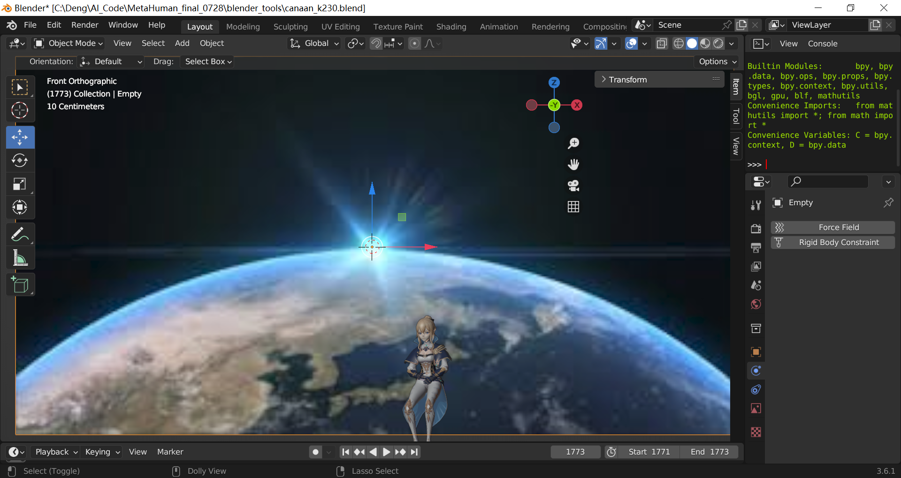


2、No module named 'cv2' in blender

```
When an error happens that no module named 'cv2' in blender, please do as follow:
1）Right click "cmd", run as administrator;
2）cd D:\Blender\3.4\python （blender installation dir）
3）.\bin\python.exe -m pip install opencv-python --target .\lib\site-packages
```


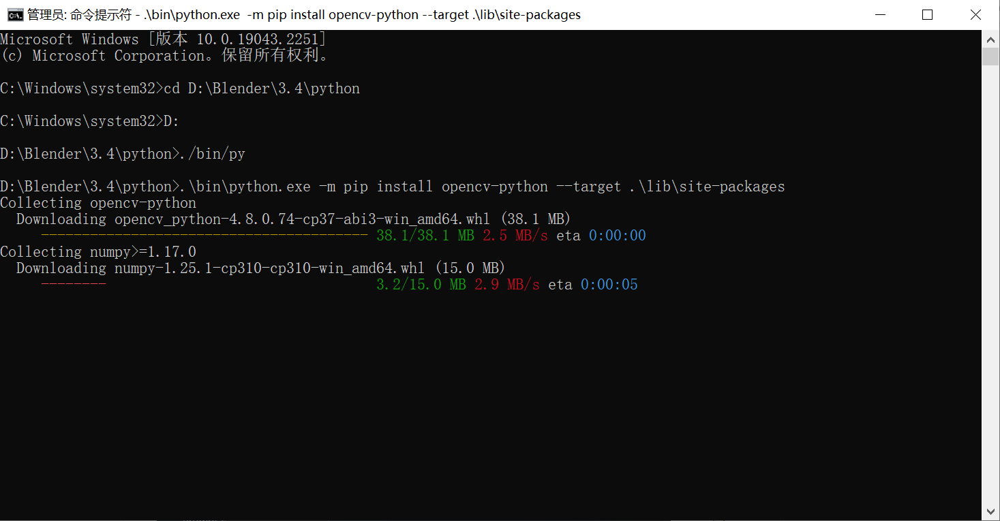
